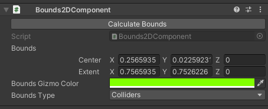
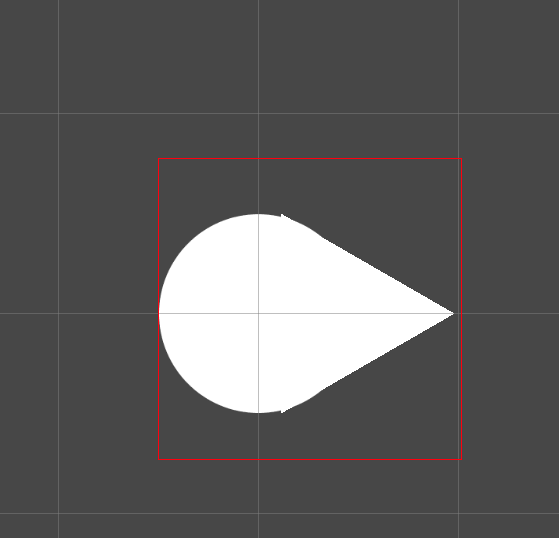

# Utils

## Bounds2DComponent
A component that draws a 2D bounding box in the scene view. <br/>
It can calculate the bounds of the object based on its sprites or Colliders 2D.




## ObservableVariable<T>
A variable of any type that can be observed for changes via UnityAction callbacks.
```csharp
 public class InventoryUiSlot : MonoBehaviour
 {
     [SerializeField] private ObservableVariable<int> stackSize;
     [SerializeField] private Text _itemCountText;
 
     private void Awake()
     {
         stackSize.OnValueChanged += OnStackSizeChanged;
     }
 
     private void OnStackSizeChanged(int oldCount, int newCount)
     {
         _itemCountText.text = newCount.ToString();
     }
 }
```

## ServiceLocator

A simple service locator that can be used to access services in the scene. <br/>
Services can be registered via the `Register` method and accessed via the `Get<T>` method.


```csharp
public interface IInventoryService : IGameService
{
    List<Item> Items { get; }
    void AddItem(Item item);
    void RemoveItem(Item item);
}
```

```csharp
public class InventoryService : MonoBehaviour, IInventoryService
{
    private void Awake()
    {
        ServiceLocator.Register<IInventoryService>(this);
    }
    
    private void OnDestroy()
    {
        ServiceLocator.Unregister<IInventoryService>(this);
    }
   
    public void AddItem(Item item) { /*... */ }
  
}
```

```csharp

public class InventoryUi : MonoBehaviour
{
    private IInventoryService _inventoryService;
 
    private void Start()
    {
        _inventoryService = ServiceLocator.Get<IInventoryService>();
    }
 
    public void OnItemClicked(Item item)
    {
       _inventoryService.AddItem(item);
    }
}
```

#### Why not use it with an ObservableVariable?
Look at the sample scene ;)
